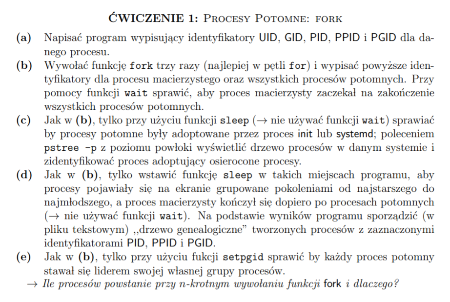

# Procesy

## Zadanie

## Ile procesow powstanie przy n-krotnym wywolaniu funkcji fork i dlaczego?
Powstanie 2^n - 1 procesów (nie licząc procesu macierzystego), ponieważ każdy
proces potomny staje się kopią swojego rodzica, w tym przypadku jeśli pętli `for` pozostały
już tylko dwie iteracje, proces potomny rownież przeprowadzi tylko dwie iteracje tej
pętli, mimo że w procesie macierzystym zadeklarowalismy, iż ma sie ona wykonaż 3 razy.
