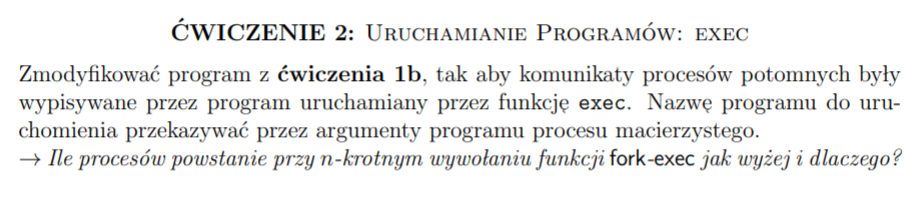

# Fork - exec

## Ile procesów powstanie przy n-krotnym wywołaniu funkcji `fork-exec` jak wyżej i dlaczego?
Powstanie n procesów (nie licząc procesu macierzystego), ponieważ funkcja
`fork` została wykonana n razy, natomiast funkcja `exec` nie tworzy dodatkowych
procesów potomnych.
