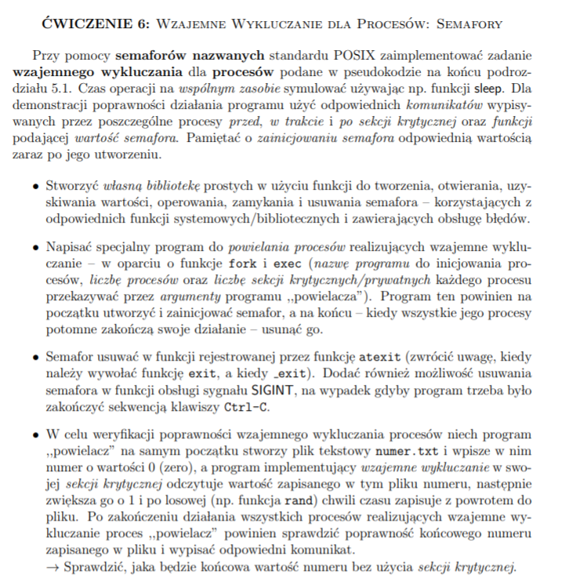

# Semafory

## Zadanie

## Sprawdzić, jaka będzie końcowa wartość numeru bez użycia sekcji krytycznej
Bez użycia sekcji krytycznej końcowa warość numeru będzie niższa, ponieważ procesy zapisujące
będą pracowały jednocześnie nad tym samym plikiem. Może dojść do sytuacji, gdzie dwa procesy
odczytają tę samą wartość, zwiększą ją o 1 i nadpiszą, co znaczy, że jeden z nich
nie zrobił nic.
