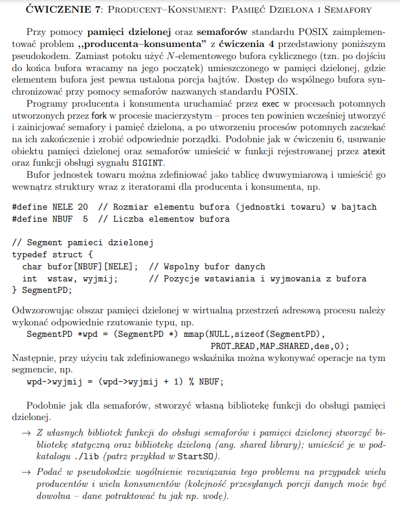

# Pamięć dzielona

## Zadanie



## Psuedokod
```
#define N ?                     // Rozmiar bufora
typdef struct { ... } Towar;    // Definicja typu dla jednostek towaru
Towar bufor[N];                 // Bufor mogacy pomiescic N jednostek towaru
int wstaw = 0, wyjmij = 0;      // Pozycje wstawiania oraz wyjmowania towaru z bufora

semaphore PROD = N;             // Semafor do wstrzymywania Producenta
semaphore KONS = 0;             // Semafor do wstrzymywania Konsumenta

semaphore P = 1;                // Semafor dla wszystkich producentow, pozwalajacy
                                // tylko jednemu naraz zapisywac dane do bufora
                                // (aby zapobiec nadpisaniu danych)
semaphore K = 1;                // Semafor dla wszystkich klientow, pozwalajacy
                                // tylko jednemu naraz odczytywac dane z bufora
                                // (aby zapobiec duplikacji danych)
```
## Proces Producent
```
Towar towarProd;
while (1) 
{
    P(P);                       // Opusc wspolny semafor producentow
    // Produkcja towaru
    P(PROD);                    // Opusc semafor Producenta
    bufor[wstaw] = towarProd;   // Umiesc towar w buforze
    wstaw = (wstaw + 1) % N;    // Przesun pozycje wstawiania o 1 dalej
    V(KONS);                    // Podniesc semafor Konsumenta
    V(P);                       // Podnies wspolny semafor producentow
    sleep();                    // Uspienie na krotki czas,aby pozwolic 
                                // innym producentom na dostarczenie towaru
}
```
## Proces Konsument
```
Towar towarKons;
while (1) 
{
    P(K);                      // Opusc wspolny semafor konsumentow
    P(KONS);                   // Opusc semafor Konsumenta
    towarKons = bufor[wyjmij]; // Umiesc towar w buforze
    wyjmij = (wyjmij + 1) % N; // Przesun pozycje wstawiania o 1 dalej
    V(PROD);                   // Podniesc semafor Producenta
    // Konsumpcja towaru
    V(K);                      // Podnies wspolny semafor konsumentow
    sleep();                   // Uspienie na krotki czas,aby pozwolic 
                               // innym konsumentom na pobranie towaru
}
```
